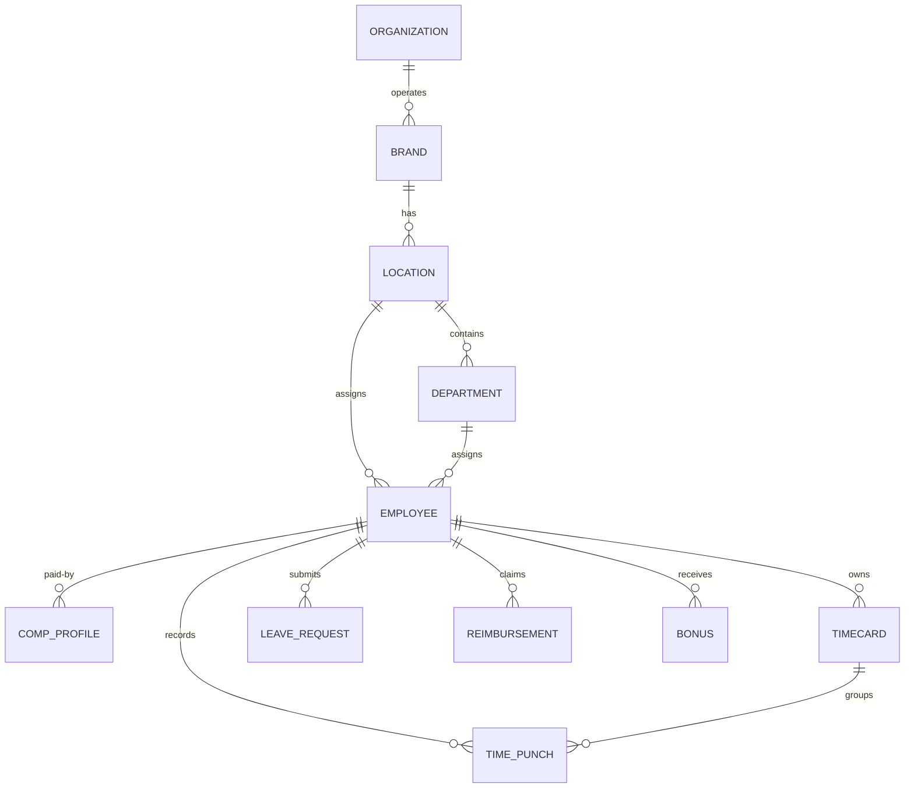

# Workforce Domain Model

This document outlines the entity relationships and definitions for VowOS workforce management, including locations, staff structures, scheduling, time clock parameters, compensation, and leave tracking.

## 1. Core Entities

### Organization
*   Global corporate container. Maintains legal name, tax identifiers, billing address, and default settings.

### Brand
*   Boutique group tags. Restricts or overrides default booking, styling, or inventory guidelines (e.g. "I Do Bridal Couture" vs "Proper & Company").

### Location (Store)
*   Physical boutique. Scopes staff assignments, inventory transfers, scheduling rules, business/holiday hours, tax jurisdictions, and default currency/timezone configurations.

### Department & Job Title
*   **Department**: Organizational cost center allocating salary/wage expenses (e.g., Sales, Management, Alterations, Receiving).
*   **Job Title**: Role descriptor independent of application authorization access permissions (e.g. Seamstress, Bridal Consultant, Store Manager).

### Employee Profile & Lifecycle
*   Extends `staff_profiles` table mapping legal identity, contact credentials, payment preference (direct deposit vs paper check), tax withholding configuration, primary/secondary location allocations, schedule rules, active lifecycle status (Invited, Active, Leave, Suspended, Terminated, Archived), and compensation.

## 2. Time & Attendance

### Time Punch
*   Idempotent event record storing type (Clock-in, Clock-out, Start-break, End-break), store geofence metadata, device verification hash, timezone offset, and manual correction audit status.

### Shift Segment
*   Allocated duration of continuous labor mapping work store location, cost-center department, and active pay rate.

### Breaks
*   Classified rest/meal periods mapped as paid vs unpaid based on shift thresholds and store/jurisdiction policies.

### Timecard
*   Consolidated wage statement summarizing shift punches, break deductions, overtime calculations, travel rates, training hours, and supervisor/employee approval signatures for a pay group period.
